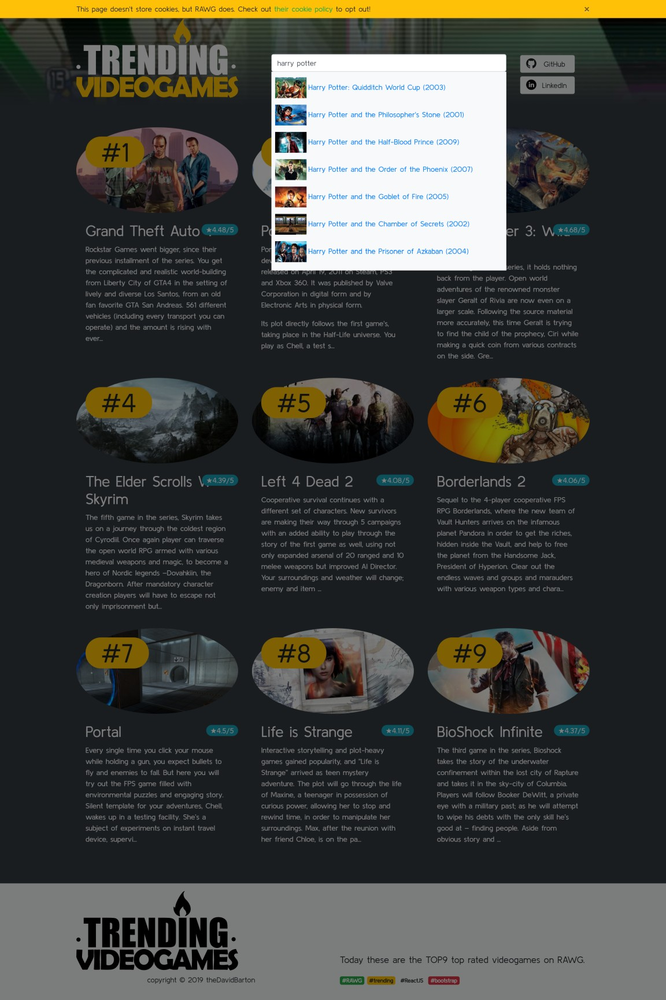

# Videogames on RAWG

Available on Heroku: [trending-video-games.herokuapp.com](https://bit.ly/video-games-on-RAWG) (redirection happens from theDavidBarton.github.io!)

## a React.Js app with Express backend

An experimental project with the **RAWG** api and **Archive.org's** search api.

## Local run

**Express backend:** `yarn`, `yarn start`

**React.Js frontend:** `cd client`, `yarn` & `yarn start`

## Simplified API docs

- `GET` **/api/trending** - used on the home page
- `GET` **/api/topRatedRecommended** - used e.g. in the header components' bg image
- `GET` **/api/videogame/{id}** - the content of a specific game
- `GET` **/api/videogameAutocomplete?q={query}**; `?q=` (mandatory) - used in the search input component's autocomplete
- `GET` **/api/searchArchive?title={query}&year={query}**; `?title=` (mandatory); `?year=` (mandatory) - searches in Archive.org's collection if an older game has an online playeable version on their servers.

See in details: [server.js](./server.js).

# License

MIT License

Copyright (c) 2019-present David Barton

# Credits

## Used data

Powered by [RAWG.io](https://rawg.io/apidocs) video game data. Thank you guys!

Powered by [Archive.org](https://archive.org/help/aboutsearch.htm) video game links. This app links some titles to the biggest web archive of the internet. Thanks Archive.org!

## Used font

'Arcade Classic' is under copyright (c) Jakob Fischer at www.pizzadude.dk, all rights reserved.
